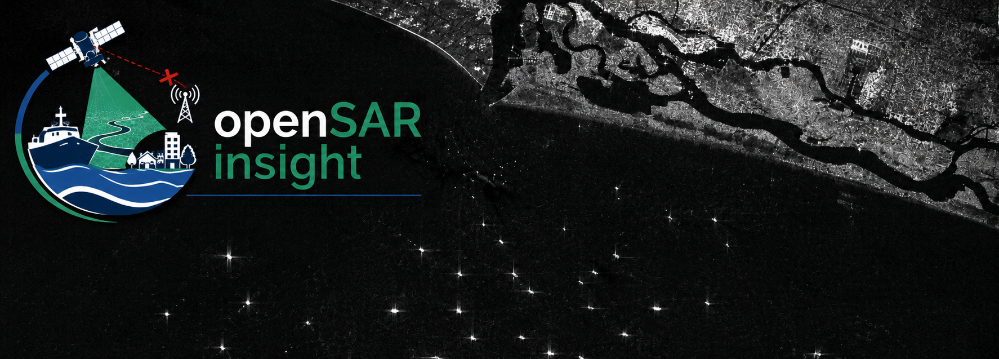

<p align="right">

</p>

[](https://philab.esa.int)
[](https://www.python.org/downloads/)
[](LICENSE)

<p align="center" style="font-size:1.5em;">
<strong>📡 OpenSAR Insight – From space to action: AI-powered satellites detecting floods, dark vessels, and radio interference instantly 📡</strong>
</p>


---

# OpenSARInsight 

**OpenSARInsight** is an early-phase project developing ML-ready datasets and algorithms for direct insight generation from raw SAR data. This is a first step toward efficient onboard implementation of end-to-end SAR inference pipelines for low-latency applications.

This project has been funded and supported by ESA’s Φ-lab.

This repository contains all software required to generate AI-ready datasets from Sentinel-1 SAR, preprocess SAR imagery, train deep learning models, validate their performance, and perform inference across multiple Earth Observation applications.

Current supported applications include:

- Vessel Detection
- Flood Detection
- Radio Frequency Interference (RFI) Detection

---

# Authors

- Indra Space ([profile](https://space.indragroup.com/en))  
- INTA (National Institute of Aerospace Technology) ([profile](https://www.inta.es/INTA/es/index.html))
- Universidad de Alcalá de Henares ([profile](https://uah.es/es/))

---

# Project Reference

**OpenSARInsight**

---

# Repository Structure

```
backend/
├── dataset_generation_scripts/
│   ├── sentinelhub-scene-downloader/
│   ├── DVD_dataset_generation/
│   ├── FD_dataset_generation/
│   ├── RFI_dataset_generation/
│   ├── L0_preparation/
│   ├── l0_to_range_compressed/
│   ├── SLC_to_FullRaw/
│   ├── orbital_file_downloader/
│   ├── L1_tiling/
│   └── dataset_splitting/
│
├── docker/
├── pipeline/
│   ├── main/
│   ├── data_preprocessing/
│   ├── dvd_use_case/
│   ├── RFI_usecase/
│   └── geocoding_block/
│
├── SARFI/
├── model_validation/
├── configuration/
├── tests/
└── README.md
```

---

# Getting Started

## 1. Setup the Docker Environment

The recommended way to run the backend is inside the provided Docker container.

See:

- [`backend/docker/README.md`](backend/docker/README.md)

Typical workflow:

1. Build the Docker image.
2. Configure `docker_dev.env`.
3. Launch the development container.
4. Install the internal dependencies.

---

## 2. Download Sentinel-1 Data

Use the SentinelHub downloader located in

- [`backend/dataset_generation_scripts/sentinelhub-scene-downloader/`](backend/dataset_generation_scripts/sentinelhub-scene-downloader/)

Documentation:

- [`backend/dataset_generation_scripts/sentinelhub-scene-downloader/README.md`](backend/dataset_generation_scripts/sentinelhub-scene-downloader/README.md)

---

## 3. Generate Training Datasets

Dataset generation tools are located inside

- [`backend/dataset_generation_scripts/`](backend/dataset_generation_scripts/)

Each use case has its own dedicated pipeline.

---

## 4. Train / Evaluate / Run Models

The main pipeline entry point is

```
backend/pipeline/main/main_pipeline.py
```

General syntax:

```bash
python main_pipeline.py \
    --model <model> \
    --mode <mode> \
    --tool <tool> \
    --extra-args "<args>"
```

To list all available options:

```bash
python main_pipeline.py --list
```

Complete documentation:

- [`backend/pipeline/README.md`](backend/pipeline/README.md)

---

# Main Components

---

## Dataset Generation

Location:

- [`backend/dataset_generation_scripts/`](backend/dataset_generation_scripts/)

This module contains all utilities required to build AI-ready datasets from Sentinel-1 products.

| Component | Description |
|------------|-------------|
| [`sentinelhub-scene-downloader`](backend/dataset_generation_scripts/sentinelhub-scene-downloader/) | Download Sentinel-1 products from the Copernicus Data Space Ecosystem |
| [`DVD_dataset_generation`](backend/dataset_generation_scripts/DVD_dataset_generation/) | Generate Vessel Detection datasets (SLC, GRD and RAW) |
| [`FD_dataset_generation`](backend/dataset_generation_scripts/FD_dataset_generation/) | Generate Flood Detection datasets |
| [`RFI_dataset_generation`](backend/dataset_generation_scripts/RFI_dataset_generation/) | Generate RFI segmentation datasets |
| [`L0_preparation`](backend/dataset_generation_scripts/L0_preparation/) | Decode Level-0 data and extract RAW patches |
| [`l0_to_range_compressed`](backend/dataset_generation_scripts/l0_to_range_compressed/) | Range compression of RAW patches |
| [`SLC_to_FullRaw`](backend/dataset_generation_scripts/SLC_to_FullRaw/) | Convert SLC detections into RAW coordinates |
| [`orbital_file_downloader`](backend/dataset_generation_scripts/orbital_file_downloader/) | Download Sentinel-1 POEORB files |
| [`L1_tiling`](backend/dataset_generation_scripts/L1_tiling/) | Convert L1 products into GeoTIFF tiles |
| [`dataset_splitting`](backend/dataset_generation_scripts/dataset_splitting/) | Create train / validation / test splits |

Each directory contains its own README with detailed usage instructions.

---

## Docker Environment

Location:

- [`backend/docker/`](backend/docker/)

Provides a fully reproducible development environment including:

- PyTorch
- CUDA
- SNAP
- SAR processing libraries
- Internal OpenSAR packages

See:

- [`backend/docker/README.md`](backend/docker/README.md)

---

## AI Processing Pipeline

Location:

- [`backend/pipeline/`](backend/pipeline/)

Provides training, inference and evaluation for all supported AI models.

### Components

| Component | Description |
|------------|-------------|
| [`main`](backend/pipeline/main/) | Unified CLI entry point |
| [`data_preprocessing`](backend/pipeline/data_preprocessing/) | Data augmentation and preprocessing |
| [`dvd_use_case`](backend/pipeline/dvd_use_case/) | YOLO-based Vessel Detection |
| [`RFI_usecase`](backend/pipeline/RFI_usecase/) | UNet-based RFI segmentation |
| [`geocoding_block`](backend/pipeline/geocoding_block/) | Convert image detections into geographic coordinates |

Documentation:

- [`backend/pipeline/README.md`](backend/pipeline/README.md)

---

## SARFI

Location:

- [`backend/SARFI/`](backend/SARFI/)

SARFI converts timestamped latitude/longitude coordinates into Sentinel-1 SLC coordinates.

Documentation:

- [`backend/SARFI/README.md`](backend/SARFI/README.md)

---

## Model Validation

Location:

- [`backend/model_validation/`](backend/model_validation/)

Contains utilities for evaluating model performance across the supported use cases.

---

## Configuration

Location:

- [`backend/configuration/`](backend/configuration/)

Contains shared configuration files used across the project.

---

# Supported AI Models

Current models include:

| Model | Task |
|---------|------|
| `vd_large` | Vessel Detection |
| `vd_small` | Knowledge-distilled Vessel Detection |
| `rfi_large` | RFI Segmentation |
| `rfi_small` | Lightweight RFI Segmentation |

---

# 📊 Supported Processing Levels

The backend currently supports processing at multiple Sentinel-1 data levels:

| Processing Level | Supported |
|-----------------|-----------|
| RAW (Level-0) | Yes |
| Range Compressed | Yes |
| SLC | Yes |
| GRD | Yes |

---

# Documentation

Every major component contains its own dedicated documentation.

Main documentation:

- [`backend/docker/README.md`](backend/docker/README.md)
- [`backend/pipeline/README.md`](backend/pipeline/README.md)
- [`backend/SARFI/README.md`](backend/SARFI/README.md)

Dataset generation documentation:

- [`backend/dataset_generation_scripts/`](backend/dataset_generation_scripts/)

---

# Dataset Hosting

The datasets used by the OpenSAR project are hosted on the **OpenSAR Insight** organization on Hugging Face.

**Hugging Face Organization:** https://huggingface.co/opensar-insight

The repository hosts datasets for the different OpenSAR use cases, including:

- Vessel Detection
- Flood Detection
- Radio Frequency Interference (RFI) Detection

Datasets contain products at multiple Sentinel-1 processing levels, including:

- Level-0 RAW
- Range Compressed
- Single Look Complex (SLC)
- Ground Range Detected (GRD)

To download datasets using the Hugging Face Hub:

```bash
pip install -U huggingface_hub

huggingface-cli login
```

Example:

```python
from huggingface_hub import snapshot_download

snapshot_download(
    repo_id="opensar-insight/<dataset_name>",
    repo_type="dataset",
    local_dir="./data"
)
```

Alternatively, datasets can be downloaded directly from:

https://huggingface.co/opensar-insight

Each dataset repository contains:

- Dataset description
- Download instructions
- Citation information
- License
- Directory structure
- Metadata and annotations

Please refer to the individual dataset documentation for details on formats, labels, and preprocessing requirements.

---
# License

This repository is licensed under the **MIT License**, except where otherwise noted.

### AGPL-3.0 Components

The following components use Ultralytics YOLO and therefore are distributed under the GNU Affero General Public License (AGPL-3.0):

- `backend/pipeline/main/`
- `backend/pipeline/dvd_use_case/`
- `backend/dataset_validation/baseline_models/dark-vessel-detection-baseline/`

### MIT Licensed Components

All remaining components are distributed under the MIT License and can be used independently without AGPL restrictions, including:

- `backend/dataset_generation_scripts/`
- `backend/pipeline/data_preprocessing/`
- `backend/pipeline/RFI_usecase/`
- `backend/pipeline/geocoding_block/`
- `backend/SARFI/`
- `backend/configuration/`
- `backend/model_validation/`

See the [LICENSE](LICENSE) file for details.

---

# 🌐 Additional Information

The repository follows a modular architecture. Each component can be developed, tested, and deployed independently while remaining fully compatible with the complete OpenSAR processing chain.

For detailed usage instructions, please refer to the README contained in each individual module.
